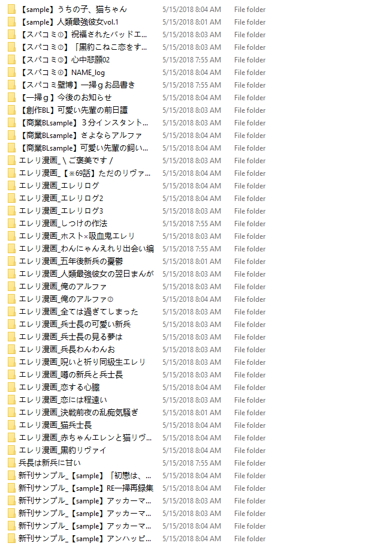

与pixiv.net爬虫工具[Pxer](https://github.com/FoXZilla/Pxer)配合使用的将下载的图片按画集分组的小工具。
# 0. 使用Pxer获得多张图片
一次下载某个创作者的所有作品，每张图片的以“画集ID_图片ID”命名。
# 1. pivix_info_crawlers

使用JavaScript从浏览器控制台获得pivix页面中的作品信息，包括画集ID和图片ID。
Pixiv网站上每张图片和每个画集都拥有唯一的ID，画集可包含一张或多种图片。

## 1.1. 获得画集ID
getBooksId.js

打开某个pixiv作者的画集浏览页面，在网页控制台中运行getBooksId.js中的代码。

获得某个创作者的所有画集的ID及其他信息，在控制台输出books变量即可。
结果示例如illu_lists.json。

## 1.2. 获得每个画集包含的图片ID
getDetail.js

打开某个pixiv作者的画集浏览页面，在网页控制台中运行getDetail.js中的代码。

获得每个画集对应的图片的ID及其他信息，在控制台idlist变量即可。
结果示例如final_list.json。

# 2. grouping
使用Python，根据final_list.json和illu_lists.json中信息对Pxer下载的图片进行处理。

#### 分组结果
